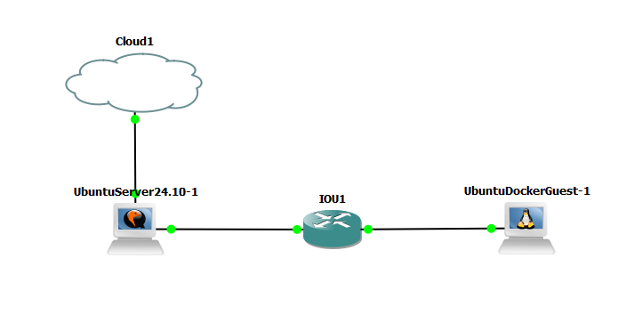

# Configure environment

1) Create script to configure all ports of the connected routed with

    - set ip addresses from 192.168.101.1/24 to 192.168.104.1/24 for ports Ethernet0/1 to Ethernet0/4
    - enable dhcp for interface eht0/1 with:
        - pool 192.168.101.100-192.168.101.200
        - gateway 192.168.101.1
        - dns will be the IP of the second interface of your container
    - create static route so that devices connected on Ethernet0/1 of "IOU1" can connect to "Ubuntu Server 24.10"
    - enable ssh connections to the device and set user password

2) Manually add new endpoint of type "Ubuntu Docker Guest"

    - connect eth0 of "Ubuntu Docker Guest" to Ethernet0/1 of "IOU1" router
    - set the interface on container to dhcp if not set by default

3) Create script to test that ping to the new "Ubuntu Docker Guest" is working from your "Ubuntu Server 24.10"

Topology:

Ubuntu Server 24.10